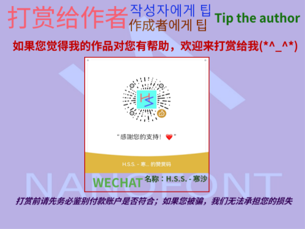

# NanoHangulHei | 納米韓國語黑體

### 간략한 소개 | 簡略한 紹介
  - 순한글 12x12 픽셀 폰트, 한글 한자(일부 약어 포함) 지원, OFL 인증 무료 사용.

  - 純한글 12x12 픽셀 폰트, 한글 漢字(一部 略語 包含) 支援, OFL 引證 無料 使用.

   

  - Dotum을 기반으로 하는 픽셀화된 글꼴
  
  - Dotum을 基盤으로 하는 픽셀化된 글꼴

### 글꼴에는 콘텐츠가 포함되어 | 글꼴에는 콘텐츠가 包含되어
  - 이 글꼴은 기본적으로 KPS9566#, EUC-KR, HANGUL 등과 같은 한글 문자 집합을 다룹니다.

  - 이 글꼴은 基本的으로 KPS9566#, EUC-KR, HANGUL 等과 같은 한글 文字 集合을 다룹니다.

 

>[!CAUTION]
>
> 이 글꼴은 서양 글꼴에 맞지 않으므로 필요한 경우 대신 다른 글꼴을 사용하십시오.
>
> 이 글꼴은 西洋 글꼴에 맞지 않으므로 必要한 境遇 代身 다른 글꼴을 使用하십시오.

#: *인터넷에서 발행된 코드 시트에 따라 만들어지며 다른 유니코드(Unicode) 문자는 추가되지 않습니다.* | *인터넷에서 發行된 코드 시트에 따라 만들어지며 다른 유니코드(Unicode) 文字는 追加되지 않습니다.*

### 글꼴 권한 부여 방법 | 글꼴 權限 附與 方法
  - 이 글꼴은 SIL-OFL v1.1 글꼴 라이선스에 따라 사용이 허가되었습니다.
  - 이 글꼴은 SIL-OFL v1.1 글꼴 라이선스에 따라 使用이 許可되었습니다.

### 작성자에게 팁 | 作成者에게 팁

### 작성자에게 문의 | 作成者에게 問議

QQ: **3582930858**

E-Mail: **3582930858@qq.com**
